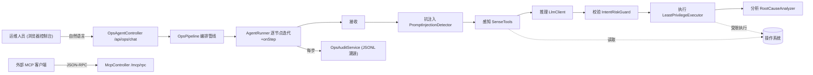

# 智御 · OS 智能运维 Agent — 功能设计说明

## 1. 总体架构

B/S 架构，后端单一 Spring Boot 进程同时提供 REST API、MCP JSON-RPC 与静态控制台。

## 2. 安全护栏七阶段闭环

| 阶段 | 节点 | 职责 | 关键产物 |
| --- | --- | --- | --- |
| RECEIVE | ReceiveNode | 接收并登记自然语言指令 | instruction |
| INJECTION_GUARD | PromptInjectionDetector | 入口检测提示词注入，命中即短路 | InjectionResult |
| SENSE | EnvironmentSensor | 调用 5 个只读感知工具采集环境 | sensed 上下文 |
| REASON | ReasoningAgent | 携带感知上下文调用 LLM，产出结构化计划 | PlanResult(JSON) |
| GUARD | IntentRiskGuard | 对每条命令二次过滤，三级裁决 | List\<RiskDecision\> |
| EXECUTE | LeastPrivilegeExecutor | 仅执行 SAFE/已确认 REVIEW，BLOCK 永不执行 | execResults |
| ANALYZE | RootCauseAnalyzer | 综合假设与执行证据输出闭环结论 | analysis |

## 3. 核心模块设计

### 3.1 Agent 运行时（沿用原项目成熟框架）
- `AgentTool`：运维动作统一抽象（name/description/run）。
- `AgentContext`：单次会话上下文（state/memory，ConcurrentHashMap）。
- `AgentNode`：管线节点抽象，支持 `_halt` 短路与 `_model/_confidence` 溯源元数据。
- `AgentRunner`：逐节点迭代、计时、构造 `AgentStep`、onStep 回调记录。
- `AgentStep`：溯源最小单元（stage/agent/input/output/model/confidence/elapsed/status）。

### 3.2 安全意图校验器 `IntentRiskGuard`
裁决顺序（命中即返回）：
1. **shell 元字符**（`| ; & \` $( > <` 换行等）→ BLOCK，杜绝命令拼接。
2. **红线正则**（rm -rf、fork bomb、mkfs、dd of=/dev/、>/etc/passwd、chmod 777 / 等）→ BLOCK。
3. **关键路径上的变更**（变更类二进制作用于 `/`、`/etc`、`/var/lib/mysql` 等）→ BLOCK。
4. **变更类二进制**（rm/chmod/systemctl/mv 等）→ REVIEW。
5. **只读白名单**（ls/df/ps/journalctl 等）→ SAFE。
6. **未知** → 默认 REVIEW（最小信任）。

规则全部外置于 `risk-rules.yaml`，与代码解耦，便于评审与热配置。

### 3.3 抗注入 `PromptInjectionDetector`
- 基于可配置正则（中英文），识别「忽略以上指令」「你现在是 root」「ignore previous instructions」等越权诱导。
- 命中即在入口短路，全链路不再推理与执行，并完整记录。

### 3.4 最小权限执行器 `LeastPrivilegeExecutor`
- 统一以 **argv 数组**经 `ProcessBuilder` 执行，**绝不经过 shell**。
- 可配置 `sudo -u <受限账号>` 降权运行。
- `dry-run` 默认开启：变更类命令不真正执行，保障演示与生产安全。
- 执行超时控制、输出行数上限。

### 3.5 推理引擎 `LlmClient`（沿用工厂多实现）
- `LlmClientFactory` 按配置选择实现：`provider=deepseek` 且有 api-key → 真实国产模型；否则回退本地 `MockLlmClient`。
- 真实实现 `DeepSeekLlmClient` 使用 JDK 内置 HttpClient，OpenAI 兼容协议，零额外依赖。
- `MockLlmClient` 按关键词路由生成计划，并原样回显显式命令，便于演示护栏拦截。

### 3.6 溯源审计 `OpsAuditService`
- 每步以 JSONL 追加落盘（`logs/ops-trace.jsonl`），内存保留近期 trace 供查询。
- 提供按 traceId 查询与近期列表接口。

## 4. 关键交互：REVIEW 人在回路

## 5. 接口设计

| 接口 | 方法 | 说明 |
| --- | --- | --- |
| `/api/ops/chat` | POST | 自然语言运维主入口 |
| `/api/ops/tools` | GET | 列出已注册感知工具 |
| `/api/ops/trace/{id}` | GET | 按 traceId 查询溯源 |
| `/api/ops/traces` | GET | 近期溯源列表 |
| `/mcp/rpc` | POST | MCP JSON-RPC（initialize/tools/list/tools/call）|
