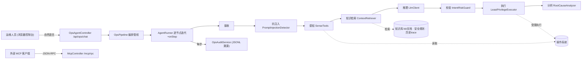
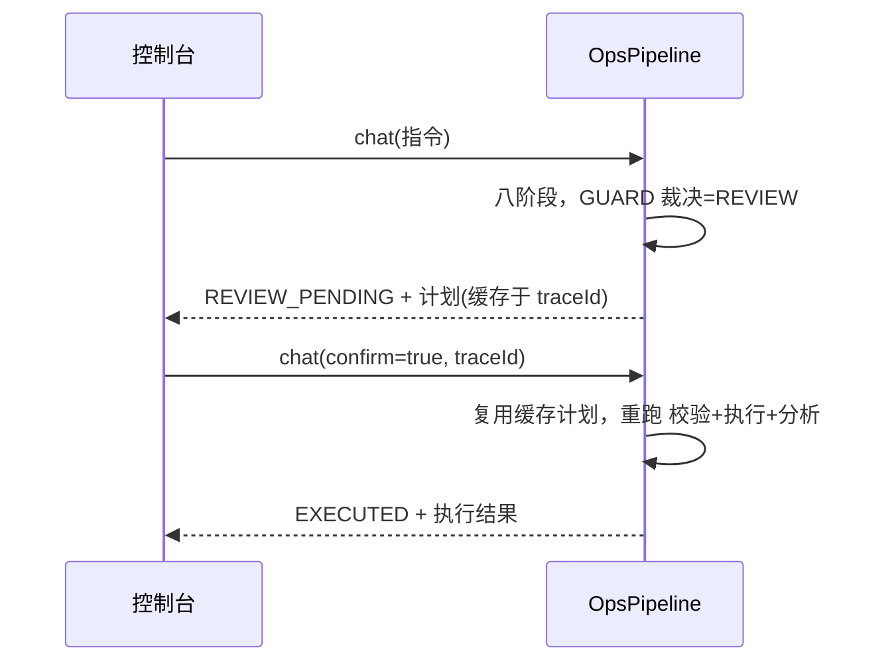

# 智御 · OS 智能运维 Agent — 功能设计说明

## 1. 总体架构

B/S 架构，后端单一 Spring Boot 进程同时提供 REST API、MCP JSON-RPC 与静态控制台。



## 2. 安全护栏八阶段闭环

| 阶段 | 节点 | 职责 | 关键产物 |
| --- | --- | --- | --- |
| RECEIVE | ReceiveNode | 接收并登记自然语言指令 | instruction |
| INJECTION_GUARD | PromptInjectionDetector | 入口检测提示词注入，命中即短路 | InjectionResult |
| SENSE | EnvironmentSensor | 调用 5 个只读感知工具采集环境 | sensed 上下文 |
| RETRIEVE | ContextRetriever | 在感知后、推理前检索可引用的运维依据（文档/规则/历史） | List\<Evidence\> |
| REASON | ReasoningAgent | 携带感知与依据调用 LLM，产出结构化计划 | PlanResult(JSON) |
| GUARD | IntentRiskGuard | 对每条命令二次过滤，三级裁决 | List\<RiskDecision\> |
| EXECUTE | LeastPrivilegeExecutor | 仅执行 SAFE/已确认 REVIEW，BLOCK 永不执行 | execResults |
| ANALYZE | RootCauseAnalyzer | 综合假设与执行证据输出闭环结论 | analysis |

> 说明：RETRIEVE 为本期新增阶段。检索到的依据仅在接入真实国产模型时注入提示词；mock 演示与自动化评测的提示词保持不变，以保证评测可复现。

## 3. 核心模块设计

### 3.1 Agent 运行时（沿用原项目成熟框架）
- `AgentTool`：运维动作统一抽象（name/description/run）。
- `AgentContext`：单次会话上下文（state/memory，ConcurrentHashMap）。
- `AgentNode`：管线节点抽象，支持 `_halt` 短路与 `_model/_confidence` 溯源元数据。
- `AgentRunner`：逐节点迭代、计时、构造 `AgentStep`、onStep 回调记录。
- `AgentStep`：溯源最小单元（stage/agent/input/output/model/confidence/elapsed/status）。

### 3.2 安全意图校验器 `IntentRiskGuard`
裁决顺序（命中即返回）：
1. **shell 元字符**（`| ; & \` $( > <` 换行等）→ BLOCK，杜绝命令拼接。
2. **红线正则**（rm -rf、fork bomb、mkfs、dd of=/dev/、>/etc/passwd、chmod 777 / 等）→ BLOCK。
3. **关键路径上的变更**（变更类二进制作用于 `/`、`/etc`、`/var/lib/mysql` 等）→ BLOCK。
4. **变更类二进制**（rm/chmod/systemctl/mv 等）→ REVIEW。
5. **只读白名单**（ls/df/ps/journalctl 等）→ SAFE。
6. **未知** → 默认 REVIEW（最小信任）。

规则全部外置于 `risk-rules.yaml`，与代码解耦，便于评审与热配置。

### 3.3 抗注入 `PromptInjectionDetector`
- 基于可配置正则（中英文），识别「忽略以上指令」「你现在是 root」「ignore previous instructions」等越权诱导。
- 命中即在入口短路，全链路不再推理与执行，并完整记录。

### 3.4 最小权限执行器 `LeastPrivilegeExecutor`
- 统一以 **argv 数组**经 `ProcessBuilder` 执行，**绝不经过 shell**。
- 可配置 `sudo -u <受限账号>` 降权运行。
- `dry-run` 默认开启：变更类命令不真正执行，保障演示与生产安全。
- 执行超时控制、输出行数上限。

### 3.5 推理引擎 `LlmClient`（沿用工厂多实现）
- `LlmClientFactory` 按配置选择实现：`provider=deepseek` 且有 api-key → 真实国产模型；否则回退本地 `MockLlmClient`。
- 真实实现 `DeepSeekLlmClient` 使用 JDK 内置 HttpClient，OpenAI 兼容协议，零额外依赖。
- `MockLlmClient` 按关键词路由生成计划，并原样回显显式命令，便于演示护栏拦截。

### 3.6 溯源审计 `OpsAuditService`
- 每步以 JSONL 追加落盘（`logs/ops-trace.jsonl`），内存保留近期 trace 供查询。
- 提供按 traceId 查询与近期列表接口。

### 3.7 运维知识检索层 `ContextRetriever`（本期新增）
- 在「感知」与「推理」之间插入 RETRIEVE 阶段，为模型提供**可引用、可溯源**的依据，使 Agent 从「会操作」升级为「有证据地操作」。
- 知识来源三路融合：① `classpath:kb/*.md` 麒麟 V11 / LoongArch 文档与故障 runbook；② `risk-rules.yaml` 危险命令/关键路径/变更类规则；③ 近期 trace 历史处置记录。
- 检索算法为关键词 + IDF 加权 BM25-lite，支持中文二元（bigram）切分，纯本地、零外部依赖；知识库为空或离线时优雅降级为空结果，不影响主链路。
- **确定性保障**：检索到的依据仅在接入真实国产模型（`llm.isReal()`）时注入提示词；mock 演示与自动化评测的提示词保持字节级不变，确保 33 项评测可复现。
- 检索结果以 `Evidence{source,title,snippet,score}` 随响应返回，控制台「知识依据 · 引用溯源」面板与「处置报告」均展示引用，便于答辩举证。详见 [10-运维知识检索层.md](10-运维知识检索层.md)。

### 3.8 MCP 服务端协议合规（`McpController`）
将运维能力以 MCP 插件化对外暴露，**严格遵循 JSON-RPC 2.0 + Model Context Protocol**（基线 `2024-11-05`，向上兼容 `2025-03-26` / `2025-06-18`），而非「仅有插件化思想」的简化实现。

- **支持的方法**：

  | 方法 | 说明 |
  | --- | --- |
  | `initialize` | 协议版本协商：回显客户端 `protocolVersion`（命中支持列表），并返回 `capabilities` / `serverInfo` / `instructions` |
  | `notifications/initialized` | 初始化完成通知；按 JSON-RPC 约定无 `id` 即为通知，服务端不返回响应体（HTTP 202） |
  | `ping` | 心跳，返回空结果 |
  | `tools/list` | 列出工具，每项含 `inputSchema`（JSON Schema，`additionalProperties:false`）与 `annotations` |
  | `tools/call` | 调用工具，返回 `content` + `structuredContent` + `isError` |

- **请求/通知区分**：校验 `jsonrpc=="2.0"`；有 `id` 为请求（必回响应），无 `id` 为通知（处理后不返回响应体）。这保证与标准 MCP 客户端握手（initialize 后紧跟一条 `notifications/initialized`）兼容。
- **错误语义分层**：协议级问题用标准错误码——`-32600` 无效请求 / `-32601` 未知方法 / `-32602` 参数非法（含未知工具名）/ `-32603` 内部错误；**工具执行失败不抛协议错误**，而是按 MCP 约定返回 `result.isError=true` + 文本内容，使客户端能区分「协议错误」与「业务失败」。
- **工具标注（ToolAnnotations）**：当前 6 个工具（5 个 `*_sense` 感知 + `health_inspect` 巡检）均为只读、无入参，统一标注 `readOnlyHint=true`、`destructiveHint=false`、`idempotentHint=true`、`openWorldHint=false`，让 MCP 客户端可直接读出「零变更」安全语义。
- **合规自证示例**：

  ```bash
  curl -s -X POST http://localhost:8080/mcp/rpc -H 'Content-Type: application/json' \
    -d '{"jsonrpc":"2.0","id":1,"method":"initialize","params":{"protocolVersion":"2025-03-26"}}'
  ```

  返回的 `result.protocolVersion` 应回显为 `2025-03-26`；`tools/list` 中每个工具均携带 `annotations`；`ping` 返回空 `result`。

## 4. 关键交互：REVIEW 人在回路



## 5. 接口设计

| 接口 | 方法 | 说明 |
| --- | --- | --- |
| `/api/ops/chat` | POST | 自然语言运维主入口 |
| `/api/ops/tools` | GET | 列出已注册感知工具 |
| `/api/ops/trace/{id}` | GET | 按 traceId 查询溯源 |
| `/api/ops/traces` | GET | 近期溯源列表 |
| `/mcp/rpc` | POST | MCP JSON-RPC 2.0 服务端（initialize / notifications/initialized / ping / tools/list / tools/call），详见 §3.8 |
